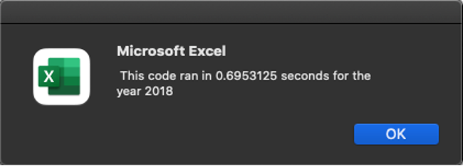

# Refactor VBA Code
## 
Purpose

###### 
The purpose of this challenge is to refactor the original VBA code to loop through all the stock data one time in order to collect the same information as the original code and determine whether refactoring the code helped run the VBA script faster. 

## 
Results

###### 
The VBA script allows the user to input the year, 2017 or 2018, for which to run the code. After running the code, the 'Total Daily Volume' and 'Return' for 12 different stock for that year are shown in worksheet "All Stocks Analysis". To make the code more efficient, a tickerIndex variable was created to access the correct index across four different arrays: tickers, tickerVolumes, tickerStartingPrices, and tickerEndingPrices, while only looping through the spreadsheet once. 

To start, a 'For' loop was created to set the volume of all tickers to zero.

Then, a 'For' loop was created to go through all the rows in the spreadsheet just once using the variable tickerIndex to gather the volume. Inside the 'For' loop, 'If' statements were used to gather the starting price and ending price for each ticker and increase the tickerIndex. 

Next, a 'For' loop was created to show the output in worksheet “All Stocks Analysis”.

Lastly, a 'For' loop was created to format the results. The ‘Return’ column was color coded to highlight stock return performance. Cells containing positive yearly returns turned green and those with negative yearly returns turned red. 

Based on yearly return, stock performace was stronger in 2017 as compared to 2018. In 2017, all stock, with the exception of TERP, showed positive yearly returns. By contrast, in 2018, only two stocks, ENPH and RUN, showed positive yearly returns. 

After refactoring the code, the time to run the script decreased. The original code took 0.90625 seconds to run for 2017 and after refactoring the code it took 0.1171875 seconds. The original code took 0.6953125 seconds to run for 2018 and after refactoring the code it took 0.109375 seconds. 

Original Code - 2017:

Refactored Code - 2017:

Original Code - 2018:

Refactored Code - 2018:

## 
Summary

######
An advantage of refactoring code is that it can result in a more efficient script that is clearer and easier to understand. It can help to remove code smell, and therefore, run a program faster.  However, the disadvantage of refactoring code is that it may introduce bugs. It can also be time consuming to refactor and test a code that may result in higher costs.  

Refactoring the VBA code resulted in a more efficient script as evidenced by the decrease in time to run the code. However, to achieve this reduced run time, several hours were spent on refactoring the code. In this situation, consideration should be given as to whether the benefit in reducing run time, which measured less than 1 second, outweighs the number of hours spent and the cost associated to refactor the code. 
